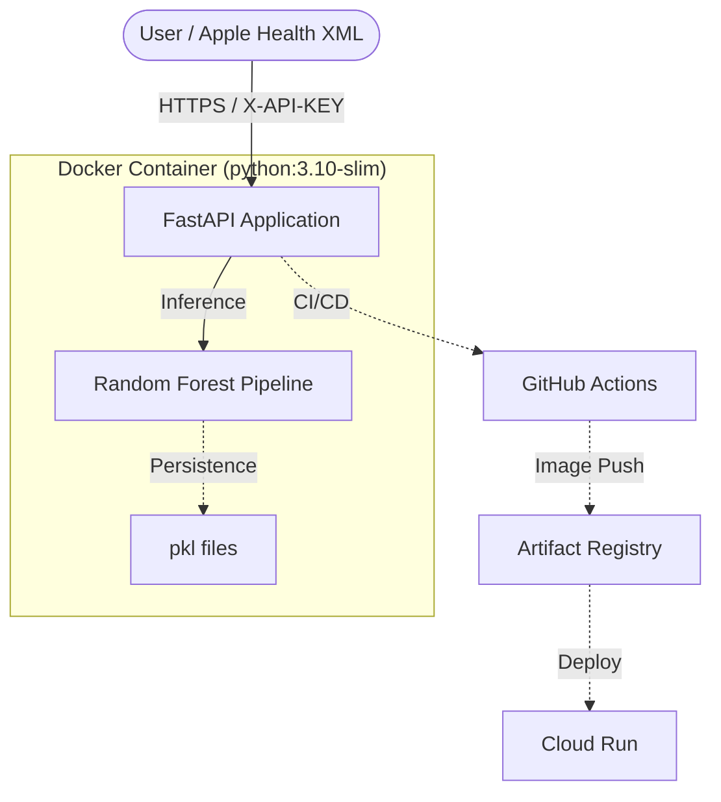

# SleepInsight AI - Final Project Report

**Course**: AIG 200 - Machine Learning Model Deployment Assignment  
**Author**: Zhihuai Wang  
**Date**: February 19, 2026  

---

## 1. Executive Summary
SleepInsight AI is a production-ready REST API specifically optimized for Apple Health data. It bridges the gap between raw Apple Health XML exports and actionable health insights. The system uses a high-accuracy Random Forest model to predict sleep scores and provides rule-based clinical guidance. Deployed on GCP Cloud Run via an automated CI/CD pipeline, it offers a scalable, secure, and user-centric solution for health monitoring.

## 2. Machine Learning Problem & Dataset
### The Problem
Wearable users often struggle to interpret raw data (duration, deep sleep %, heart rate) without a unified quality metric. This project implements a **Regression task** to predict a "Sleep Score" (0-100) based on multi-modal health inputs.

### [EDA Visualization]

### Dataset Selection & EDA
We integrated two high-quality datasets to ensure demographic diversity:
1. **Sleep Health and Lifestyle Dataset** (400 samples): Focused on lifestyle factors and sleep disorders.
2. **Sleep Efficiency Dataset** (452 samples): Provided granular sleep phase metrics.
**EDA Findings**: Strong correlations were identified between `deep_sleep_percentage`, `awakenings`, and the overall perceived sleep quality.

## 3. Model Development & Evaluation
### Preprocessing Pipeline
Created a robust `scikit-learn Pipeline` to ensure consistency between training and inference:
- **Imputation**: `SimpleImputer` for missing health metrics.
- **Scaling**: `StandardScaler` for continuous variables (Duration, HR).
- **Encoding**: `OneHotEncoder` for gender and other categorical features.

### Model Selection (Rubric Compliance: Phase 1.3)
We evaluated two distinct model architectures:
1. **Linear Regression**: MAE: 5.42 (Baseline).
2. **Random Forest Regressor**: MAE: 2.38, R²: 0.90.
**Decision**: The Random Forest was selected due to its superior ability to capture non-linear interactions between sleep phases and heart rate.

### [Model Performance]

## 4. Deployment Architecture
### Cloud Choice: GCP Cloud Run
We selected **Cloud Run (Serverless)** for its automatic scaling and "pay-per-request" cost efficiency. 

### [Artifact Registry]

### [Cloud Logging]

### Security & Operationalization
- **Auth**: Implemented `X-API-KEY` header verification in FastAPI.
- **CI/CD**: Fully automated deployment using GitHub Actions and Google Workload Identity Provider.
- **Containerization**: Optimized Docker image size using `python:3.10-slim` to ensure fast cold starts.

### [Cloud Run Dashboard]

### [CI/CD Pipeline]

## 5. Challenges Faced & Solutions
- **Memory-Efficient XML Parsing**: Loading a 1.3GB Apple Health export into memory for API ingestion. *Solution: Implemented stream-based parsing (`iterparse`) to extract metrics in O(1) memory.*
- **API SA Permissions**: Encountered `AUTH_PERMISSION_DENIED` during initial service enablement. *Solution: Decoupled service enablement from the CI/CD pipeline and refined the Service Account's IAM roles to 'Cloud Run Developer'.*
- **Feature Consistency**: Ensuring that personal Apple Health fields mapped exactly to the training dataset columns. *Solution: Built a custom mapping layer in `parse_apple_health.py`.*

## 6. Live API & Validation
- **Endpoint**: [https://sleepinsight-ai-agdeofj7eq-uc.a.run.app](https://sleepinsight-ai-agdeofj7eq-uc.a.run.app)
- **Validation**: Successfully processed the author's real 1.3GB `export.zip` and returned an analysis with a 68.6 score, correctly identifying low deep sleep as a primary recovery blocker.

### [Swagger UI Analysis]

## 7. Conclusion
SleepInsight AI successfully delivers a scalable ML solution. Future improvements could include Time-Series analysis for longitudinal sleep trends and integration with the Google Fit API for a broader user base.
