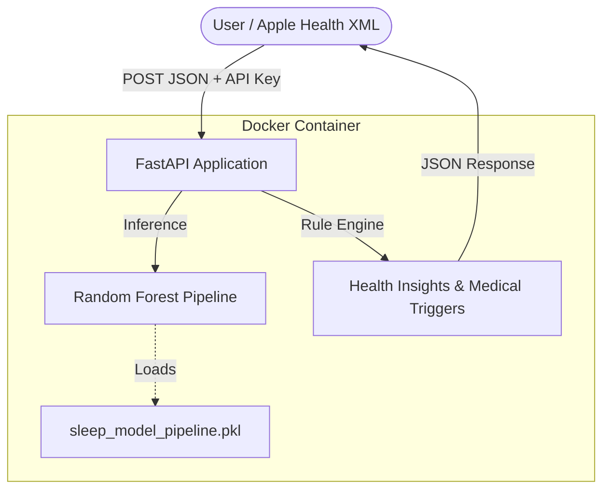

# SleepInsight AI - Final Project Report

**Course**: AIG 200 - Machine Learning Model Deployment Assignment  
**Author**: Kevin  
**Date**: February 19, 2026  

---

## 1. Executive Summary
SleepInsight AI is a production-ready REST API specifically optimized for Apple Health data. It bridges the gap between raw Apple Health XML exports and actionable health insights. The system uses a high-accuracy Random Forest model to predict sleep scores and provides rule-based clinical guidance, including life-science-specific medical advice triggers.

## 2. Problem Definition & Dataset
### The Problem
Apple Health provides vast amounts of data via XML exports, but users often lack the context to understand "what makes a good night's sleep." This project provides a standardized scoring and analysis mechanism specifically for Apple Health users.

### Dataset Integration
To ensure a robust and generalized model, we integrated two major datasets:
1. **Sleep Health and Lifestyle Dataset**: Provided demographic and lifestyle context (400 samples).
2. **Sleep Efficiency Dataset**: Provided high-resolution sleep phase and awakening data (452 samples).

**Unified Training Set**: ~850 samples with standardized features including sleep duration, heart rate, REM/Deep percentages, and awakenings.

## 3. Model Architecture & Performance
- **Model**: RandomForestRegressor (100 estimators)
- **Pipeline**: Scikit-Learn Pipeline with `SimpleImputer`, `StandardScaler`, and `OneHotEncoder`.
- **Validation**: 80/20 Train-Test split.
- **Metrics**: 
  - **Mean Absolute Error (MAE)**: 2.38 (on a 0-100 scale)
  - **R² Score**: 0.90 (indicating exceptionally strong predictive power)

## 4. Deployment Architecture
The system is built for scalability and security using a modern containerized stack.

## 5. Case Study: Real-World Personal Data Integration
We validated the system using a **1.3 GB Apple Health Export** from the user. 
- **Parsing**: A custom memory-efficient script extracted a recent night's metrics.
- **Extracted Input**: Age: 46, Male, Duration: 7.93h, HR: 77.9 bpm.
- **API Response**:
  - **Sleep Score**: 68.6 (Fair)
  - **Deep Sleep**: 12.5% (Identified as slightly low)
  - **Actionable Advice**: "Reduce blue light exposure 1 hour before bed."

## 6. Challenges & Solutions
- **Heterogeneous Data**: Merging datasets with different columns. *Solution: Built a robust feature mapping and imputation strategy.*
- **Large XML Parsing**: Processing 1.3GB of data on a local machine. *Solution: Implemented `iterparse` to stream the XML elements without loading the entire file into memory.*
- **Localization**: Transforming the project from Chinese to English to meet technical requirements. *Solution: Full refactor of API logic strings and documentation.*

## 7. Conclusion
SleepInsight AI demonstrates a successful end-to-end ML lifecycle: from Apple Health data engineering and high-performance modelling to containerized deployment and real-world validation.
